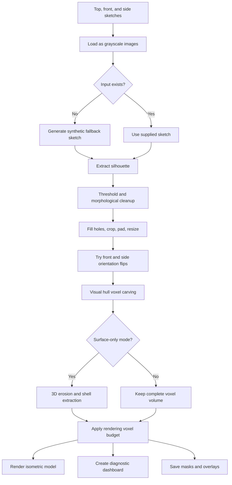

# 3D Reconstruction from Orthographic Sketches

This project reconstructs a 3D voxel model from three 2D orthographic sketches:

- Top view
- Front view
- Side view

It uses image processing and visual-hull space carving rather than machine learning. The result is saved as high-resolution PNG images showing the reconstructed 3D shape, the extracted silhouettes, and diagnostic overlays.

## What the program does

`reconstruct_3d.py` performs the following pipeline:

1. Loads the top, front, and side grayscale sketches.
2. Creates a synthetic sketch automatically when an input file is missing.
3. Extracts a filled binary silhouette from each sketch.
4. Crops, pads, and resizes each silhouette to a square voxel resolution.
5. Tests horizontal flips of the front and side masks to find the best view alignment.
6. Carves a 3D visual hull by intersecting the three orthographic silhouettes.
7. Optionally removes interior voxels, leaving only the outer surface shell.
8. Downsamples large models when necessary to stay within the rendering budget.
9. Saves a 3D isometric render, a summary dashboard, masks, and colored overlays.

## Algorithm diagram



## Core reconstruction equation

Each input mask is projected through the third dimension. A voxel is occupied only when it is inside all three silhouettes:

```text
V[z, y, x] = top_mask[y, x] AND front_mask[z, x] AND side_mask[z, y]
```

This produces a visual hull: the largest volume consistent with the supplied silhouettes. It cannot recover hidden concavities that are not visible in the three views.

## Input files

Place these files in the same directory as `reconstruct_3d.py`:

| File | Meaning |
| --- | --- |
| `Screenshot 2025-10-12 185245.png` | Top view sketch |
| `Screenshot 2025-10-12 185254.png` | Front view sketch |
| `Screenshot 2025-10-12 185304.png` | Side view sketch |

Input images may be grayscale or color; they are converted to grayscale automatically. The sketches should have dark object boundaries on a light background. If a file is missing or cannot be read, a built-in synthetic sketch is generated and saved using that filename.

## Requirements

- Python 3.9 or newer
- NumPy
- SciPy
- Matplotlib
- Pillow
- OpenCV is optional. When installed, it provides adaptive thresholding and flood-fill processing; otherwise the script uses a SciPy/NumPy fallback.

Install the dependencies with:

```bash
python -m pip install -r requirements.txt
```

## Running the program

From the project directory, run:

```bash
python reconstruct_3d.py
```

The script prints timestamped progress messages and writes all generated images next to the script.

## Outputs

| Output | Description |
| --- | --- |
| `isometric_view.png` | High-resolution 3D isometric voxel rendering |
| `reconstruction_summary.png` | Dashboard containing the three inputs, three mask overlays, and the 3D model |
| `mask_top.png` | Resized binary top silhouette |
| `mask_front.png` | Resized binary front silhouette after orientation optimization |
| `mask_side.png` | Resized binary side silhouette after orientation optimization |
| `overlay_top.png` | Top input with cyan mask overlay |
| `overlay_front.png` | Front input with cyan mask overlay |
| `overlay_side.png` | Side input with cyan mask overlay |

## Configuration

The main settings are constants near the top of `reconstruct_3d.py`:

| Setting | Default | Purpose |
| --- | ---: | --- |
| `VOXEL_RESOLUTION` | `96` | Width, height, and depth of normalized masks and the initial voxel grid |
| `MASK_ALPHA` | `0.45` | Opacity of the cyan diagnostic overlays |
| `CAMERA_ELEVATION` | `30` | Matplotlib 3D camera elevation in degrees |
| `CAMERA_AZIMUTH` | `45` | Matplotlib 3D camera azimuth in degrees |
| `EXTRACT_SURFACE_ONLY` | `True` | Removes interior voxels before rendering |
| `MAX_VOXELS_FOR_RENDER` | `150000` | Maximum active voxels used for rendering before downsampling |

## Important implementation details

### Silhouette extraction

With OpenCV installed, the script uses normalization, adaptive Gaussian thresholding, morphological closing and dilation, then flood-fill hole filling. Without OpenCV, it uses Gaussian smoothing, a local intensity comparison, SciPy dilation, and binary hole filling.

Every mask is cropped to its active content, padded to a square while preserving proportions, and resized to `VOXEL_RESOLUTION x VOXEL_RESOLUTION`.

### Orientation optimization

The front and side masks are tested in four combinations: unchanged, front-flipped, side-flipped, and both-flipped. The candidate with the largest connected 3D component is selected, with total occupied voxel count used as a secondary score.

### Surface extraction and rendering

When `EXTRACT_SURFACE_ONLY` is enabled, one 3D binary erosion is subtracted from the model. This keeps the boundary shell and reduces the number of voxels passed to Matplotlib. Models exceeding `MAX_VOXELS_FOR_RENDER` are rendered at a larger voxel stride.

## Limitations

- The method assumes the three images are orthographic views with compatible scale and alignment.
- It reconstructs a visual hull, not a full CAD solid or watertight mesh.
- Hidden cavities and details absent from every silhouette cannot be inferred.
- Line sketches with gaps, heavy noise, shadows, or unrelated marks may produce inaccurate masks.
- The output is a voxel visualization in PNG format; the program does not currently export STL, OBJ, or other mesh formats.

## Project structure

```text
reconstruct_3d.py                  Main reconstruction pipeline
requirements.txt                   Python dependencies
README.md                          Project documentation
Screenshot ... 185245.png          Top input sketch
Screenshot ... 185254.png          Front input sketch
Screenshot ... 185304.png          Side input sketch
isometric_view.png                 Generated 3D render
reconstruction_summary.png         Generated diagnostic dashboard
mask_*.png                         Generated binary masks
overlay_*.png                      Generated diagnostic overlays
```

## License

No license has been specified for this repository.
